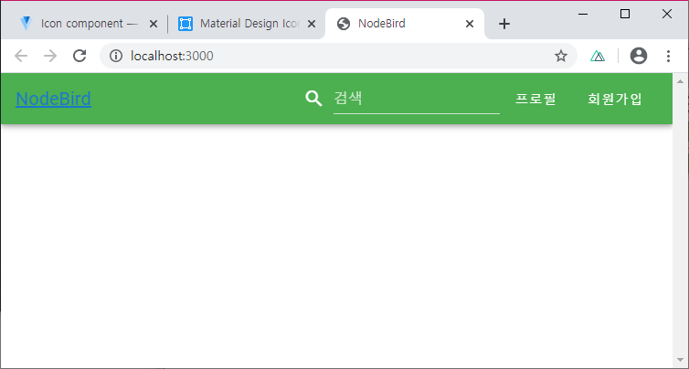
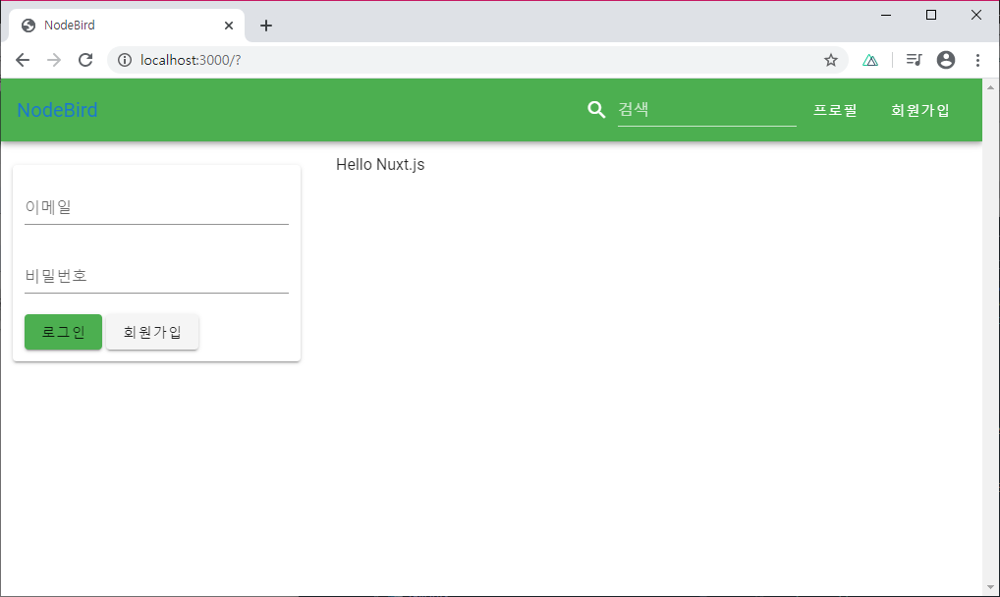

### [문제 01-01] 다음을 마크업 하여라.



layouts/default.vue
```HTML
<template>
  <v-app>
    <nav>
      <v-toolbar dark color="green">
        <v-toolbar-title>
          <nuxt-link to="/">NodeBird</nuxt-link>
        </v-toolbar-title>

        <v-spacer></v-spacer>
        <v-toolbar-items>
          <v-text-field label="검색" hide-details prepend-icon="mdi-magnify" :style="{ display: 'flex', alignItems: 'center'}"/>
          <v-btn text nuxt to ="/profile">
            <div>프로필</div>
          </v-btn>
          <v-btn text nuxt to="/signup">
            <div>회원가입</div>
          </v-btn>
        </v-toolbar-items>
      </v-toolbar>
    </nav>
  </v-app>
</template>
<script>
  export default {
  }
</script>

<style>
</style>
```
pages/index.vue
```html
<template>
  <div>
    Hello {{name}}
  </div>
</template>

<script>
  export default {
    data() {
      return {
        name: 'Nuxt.js',
      }
    },
  }
</script>

<style>
</style>
```

### [문제 01-01] 다음을 마크업 하여라.


components/LoginForm.vue
```HTML
<template>
  <v-container>
    <v-card>
      <v-form>
        <v-container>
          <v-text-field
            label="이메일"
            type="email"
            required
          />
          <v-text-field
            label="비밀번호"
            type="password"
            required
          />
          <v-btn color="green" type="submit">로그인</v-btn>
          <v-btn>회원가입</v-btn>
        </v-container>
      </v-form>
    </v-card>
  </v-container>
</template>

<script>
  export default {

  }
</script>

<style>
</style>
```
